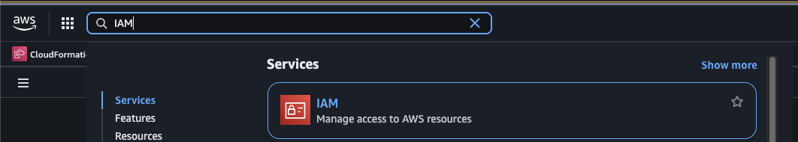
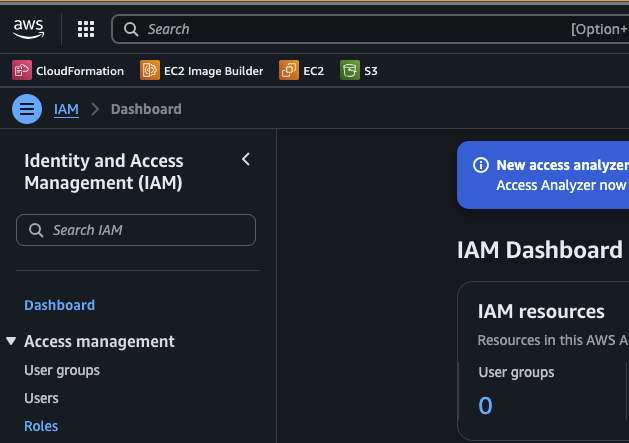
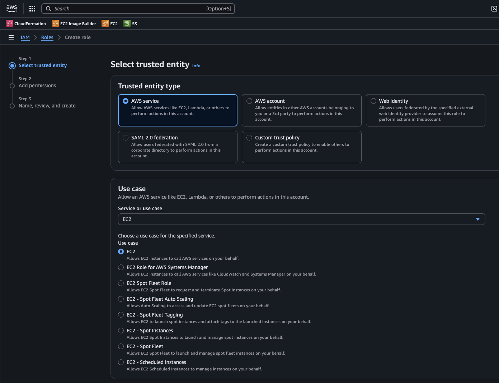
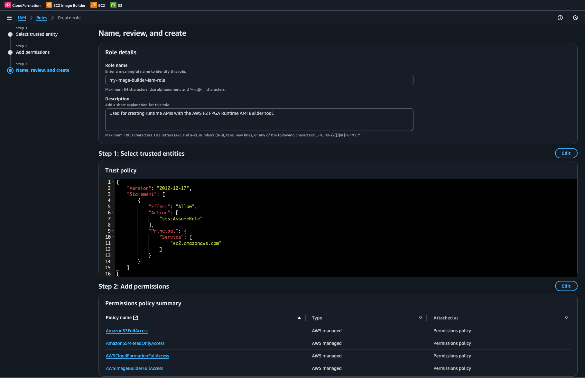
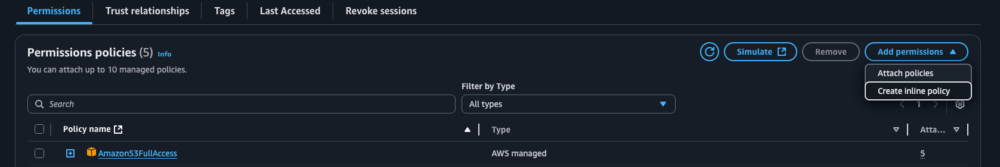
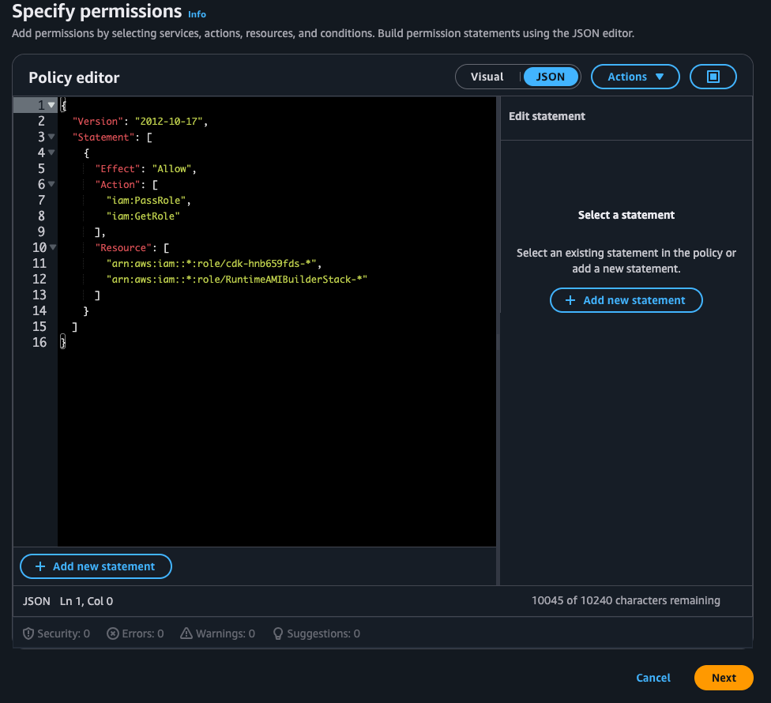
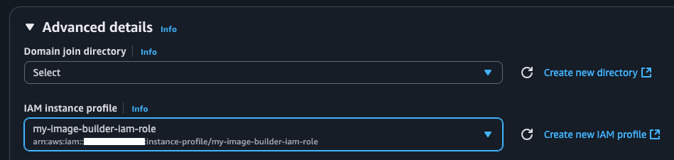
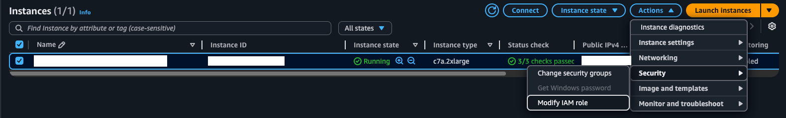

# AWS EC2 F2 FPGA Runtime AMI Builder

After creating an Amazon FPGA Image (AFI), we suggest creating a runtime AMI using the Runtime AMI Builder (RAB). This tool was created to design an AMI to pair with specific accelerated application's needs. Use of the RAB offers the following benefits:

- **Reduced storage costs**
  - Smaller base image with reduced root-volume storage capacity
- **A Production-ready environment**
  - Install only what's needed to run a production accelerator design and host application
- **Flexibility and Extensibility**
  - Create components to install or use any software not included with the FPGA Developer Kit
- **Customizable deployment**
  - Automatically share runtime AMIs with AWS accounts in any region F2 instances are available

The RAB makes creating a runtime AMI for individual applications convenient by simplifying the use of the AWS CDK to create EC2 Image Builder pipelines. This guide demonstrates using the RAB on the FPGA Developer AMI to build a runtime AMI with the following tools installed:

- Python 3.12 (Rocky Linux only)
- The AWS CLI
- The AWS FPGA SDK (SDK)
- Runtime utilities for performance optimization
- Vivado Lab Edition (VLE)
- The Xilinx Virtual Cable driver (XVC)

## Table of Contents

- [What is the AWS CDK?](#what-is-the-aws-cdk)
- [What Does Using the Runtime AMI Builder Cost?](#what-does-using-the-runtime-ami-builder-cost)
- [Running Individual Installation Scripts Locally](#running-individual-installation-scripts-locally)
- [AWS Account IAM Role Setup for Runtime AMI Builder Use](#aws-account-iam-role-setup-for-runtime-ami-builder-use)
  - [Using the Runtime AMI Builder IAM Role](#using-the-runtime-ami-builder-iam-role)
- [Installing Node.js](#installing-nodejs)
- [Installing AWS CDK Dependencies](#installing-aws-cdk-dependencies)
- [Customizing the Runtime AMI Build](#customizing-the-runtime-ami-build)
  - [Configuration and Resource Deployment](#configuration-and-resource-deployment)
  - [Choosing a Base AMI](#choosing-a-base-ami)
  - [Versioning the Image Recipe](#versioning-the-image-recipe)
  - [Choosing a Vivado Lab Edition Tool Version](#choosing-a-vivado-lab-edition-tool-version)
  - [Sizing AMI Storage](#sizing-ami-storage)
  - [Auto-Sharing with Other AWS Accounts](#auto-sharing-with-other-aws-accounts)
  - [Auto-Sharing in Specific Regions](#auto-sharing-in-specific-regions)
  - [Selecting a Build Instance Type](#selecting-a-build-instance-type)
  - [Customizing AMI Info](#customizing-ami-info)
  - [Selecting Components to Use in the Runtime AMI](#selecting-components-to-use-in-the-runtime-ami)
- [Bootstrapping, Deploying, and Running the Image Builder Pipeline](#bootstrapping-deploying-and-running-the-image-builder-pipeline)
  - [Bootstrap the CDK (First Deployment Only)](#bootstrap-the-cdk-first-deployment-only)
  - [Verify the Settings](#verify-the-settings)
  - [Deploy the Image Builder Pipeline](#deploy-the-image-builder-pipeline)
  - [Running the Image Builder Pipeline](#running-the-image-builder-pipeline)
  - [Cleaning Up Resources](#cleaning-up-resources)
- [Creating Custom Components](#creating-custom-components)
- [Issues/Support](#issuessupport)
- [FAQ](#faq)

## What is the AWS CDK?

The Runtime AMI Builder uses the [**AWS Cloud Development Kit (CDK)**](https://docs.aws.amazon.com/cdk/v2/guide/home.html), which is a framework for defining cloud infrastructure as code through familiar programming languages. No prior knowledge about the CDK is needed to use this tool, but a basic understanding of these concepts will help:

- **CDK** converts the RAB's TypeScript code into AWS CloudFormation templates
- **CloudFormation** is AWS's service for creating and managing cloud resources
- **Bootstrapping** sets up the necessary CDK infrastructure in the deploying AWS account (one-time setup)
- **Synthesizing** shows what resources will be created without actually creating them
- **Deploying** creates the actual Image Builder pipeline and related resources

To use the RAB, only three core files need to be edited to create a runtime AMI build configuration. After that, only two commands are needed to deploy the EC2 Image Builder pipeline.

## What Does Using the Runtime AMI Builder Cost?

[The EC2 Image Builder is offered at no cost, other than the cost of the underlying AWS resources used to create, store, and share the images](https://aws.amazon.com/image-builder/faqs/). This means that the Image Builder pipeline and CloudFormation stack cost nothing to use or deploy.

- [Instance pricing](https://aws.amazon.com/ec2/pricing/)
- [EBS (instance-attached storage) pricing](https://aws.amazon.com/ebs/pricing/)
- [S3 storage pricing](https://aws.amazon.com/s3/pricing/?nc2=h_pr_s3)

## Running Individual Installation Scripts Locally

Before cloning the FPGA Developer Kit onto either base AMI, install `git`.
After the FPGA Developer Kit is cloned onto the base AMI, the installation scripts used by the RAB may be executed individually on the base AMI.
This is greatly reduces iteration time before setting up an EC2 Image Builder pipeline.
If all components are being installed via local execution of the installer scripts, they must be run in this order to satisfy tool and package dependencies:

1. [install_script_execution_essentials.sh](./scripts/install_script_execution_essentials.sh)
2. [update_rocky_python.sh](./scripts/update_rocky_python.sh)
3. [install_aws_cli.sh](./scripts/install_aws_cli.sh)
4. [install_f2_runtime_utils.sh](./scripts/install_f2_runtime_utils.sh)
5. [install_vivado_lab_edition.sh](./scripts/install_vivado_lab_edition.sh)
6. [install_xilinx_virtual_cable.sh](./scripts/install_xilinx_virtual_cable.sh)
7. [sdk_setup.sh](./../../sdk_setup.sh) \(must be sourced\)

Refer to each script to see any necessary flags and arguments.

> install_xilinx_virtual_cable.sh emits an error if ran on a compute instance.
If "XVC PCIe driver installation complete!" is emitted when ran, this error can be ignored.

## AWS Account IAM Role Setup for Runtime AMI Builder Use

The RAB requires access to an AWS account's resources via an IAM role. To create an IAM role with the necessary permissions, follow these steps:

1. In a browser, navigate to the AWS EC2 Console
2. In the search bar, search for "IAM" and click on it in the search results

   

3. On the IAM console, click "Roles" on the left side of the console

   

4. On the Roles screen, click "Create role" in the top right corner of the console

   

5. Under "Select trusted entity", select "AWS service" as the "Trusted entity type"
6. Under "Use case" select "EC2"
7. On the choice selection that appears, use "EC2"

    

8. Click the "Next" button
9. On the "Add permissions" screen, add the following **managed policies**:
   - AmazonS3FullAccess
   - AmazonSSMReadOnlyAccess
   - AWSCloudFormationFullAccess
   - AWSImageBuilderFullAccess

> ⚠️ **Security Best Practice**: These managed policies grant broad permissions for ease of setup. After becoming comfortable with the RAB, we recommend creating custom policies that limit access to specific resources (e.g., only the CDK bootstrap bucket for S3, only RuntimeAMI* resources for Image Builder). See [AWS IAM Best Practices](https://docs.aws.amazon.com/IAM/latest/UserGuide/best-practices.html) for guidance on implementing least-privilege access.

10.   Under "Name, review, create", give the role a name and description that associates it with building runtime AMIs
11.  In the "Step 1: Select trusted entities" form, no edits are necessary when using the permissions above

  

12.  Now click "Create role"
13.  Search for the newly created role in the IAM console and open its details page
14.  Click the "Add permissions" dropdown and select "Create inline policy"

  

15.   In the JSON editor, paste the policy below and give it an identifiable name, then click "Next"

  ```json
  {
    "Version": "2012-10-17",
    "Statement": [
      {
        "Effect": "Allow",
        "Action": [
          "iam:PassRole",
          "iam:GetRole"
        ],
        "Resource": [
          "arn:aws:iam::*:role/cdk-hnb659fds-*",
          "arn:aws:iam::*:role/RuntimeAMIBuilderStack-*"
        ]
      }
    ]
  }
  ```

  

16. Finally, verify the created role by checking that it has the 4 permissions and another based on the policy above

### Using the Runtime AMI Builder IAM Role

When running the RAB on an AWS EC2 Instance, make sure to attach the created IAM role under the "Advanced details" section in the Launch Instances interface.

  

If the instance is already launched, the IAM role can be attached to it retroactively. On the EC2 Instances screen, select modify IAM role under Actions -> Security.

  

At this point the RAB is ready to run after SSHing onto the instance.

## Installing NodeJS

The AWS CDK depends on `Node.js` to function. More information about [supported versions is available here](https://docs.aws.amazon.com/cdk/v2/guide/node-versions.html).

To install Node.js, [visit the download page](https://nodejs.org/en/download) and choose a version. This guide uses `Linux` as the platform, `nvm` as the Node.js version manager, and `npm` as the package manager.

## Installing AWS CDK Dependencies

After installing Node.js, source the setup script to install the CDK and its dependencies and perform any necessary security updates for those npm packages:

```bash
cd $path_to_fpga_developer_kit/developer_resources/runtime_ami_builder
. runtime_ami_builder_setup.sh
```

This will also set the `RAB_DIR` environment variable which is used later on in this guide.

## Customizing the Runtime AMI Build

### Configuration and Resource Deployment

The RAB can be configured via the `context` section of [lib/cdk.jsonc](./lib/cdk.jsonc). In this section are all of the values that can be adjusted to create a runtime AMI, along with descriptions of what they do. These context values also allow configuration of the region where the CloudFormation and EC2 Image Builder pipeline the CDK creates are deployed.

> Unless mentioned otherwise, all configuration discussed will take place in [lib/cdk.jsonc](./lib/cdk.jsonc).

### Choosing a Base AMI

Two default base AMIs are available: `Rocky Linux 8.10` and `Ubuntu 24.04`. The AMI configurations are defined in [lib/types.ts](./lib/types.ts) using their AMI IDs for `us-east-1`. To add and use a different base AMI, modify `BASE_AMI_CONFIGS` in [lib/types.ts](./lib/types.ts) to include the new AMI's ID and configuration details. We recommend choosing an AMI without a product code attached to it. To find an AMI that without a product code, use the following command:

```bash
aws ec2 describe-images --filters "Name=name, Values=*OS_NAME_GOES_HERE*" --query 'Images[].[ImageId,Name,CreationDate,ProductCodes[0].ProductCodeId || `null`]' --output table | grep None
```

The `*`s to each side of the OS name are standard wild-card characters and will help yield the most results for the OS of interest.

> The AMI used as the base for the runtime AMI must exist in the region the CDK resources are deployed in.

### Versioning the Image Recipe

Image recipe versioning, as the name suggests, provides version control over image builder pipelines and components. The image recipe version must be incremented between changes to any of the files used by the RAB.

### Choosing a Vivado Lab Edition Tool Version

The two default base AMIs are supported by [Vivado Lab Edition 2025.1](https://docs.amd.com/r/en-US/ug973-vivado-release-notes-install-license/Supported-Operating-Systems).
Other supported versions will be listed in [supported_vivado_lab_edition_versions.txt](./supported_vivado_lab_edition_versions.txt) when they are added to the RAB.

If Vivado Lab Edition is not required, remove the `installVivadoLabEdition` component from `componentConfigs` in [lib/runtimeAmiBuilder.ts](./lib/runtimeAmiBuilder.ts).

### Sizing AMI Storage

Fine-tuning the storage capacity of the runtime AMI is done here. Root volume storage sizing provides precise [storage cost control](https://aws.amazon.com/s3/pricing/?p=pm&c=s3&z=4).

### Auto-Sharing with Other AWS Accounts

Add any AWS accounts to be granted launch permissions for the runtime AMI. This does **not** grant the target accounts ownership of it. If no other accounts need to be granted launch permissions, set this value to `[]`.

### Auto-Sharing in Specific Regions

Distribution of the runtime AMI to the regions specified is handled automatically as part of the EC2 Image Builder pipeline. This makes the runtime AMI available in the specified regions for only the deploying account and the accounts granted launch permissions above. If the runtime AMI is not needed in regions other than the deployment one, set the value to `[]`.

### Selecting a Build Instance Type

The instance type and size chosen will affect the speed of the runtime AMI build. [Instance type pricing can be seen here](#what-does-using-the-runtime-ami-builder-cost).

### Customizing AMI Info

The AMI's name, unique identifier, description, and tags may all be configured as well.

> Spaces aren't allowed in the unique identifier field.

### Selecting Components to Use in the Runtime AMI

Edit the `componentConfigs` list in [lib/runtimeAmiBuilder.ts](./lib/runtimeAmiBuilder.ts) to choose which components will be installed on the runtime AMI.

## Bootstrapping, Deploying, and Running the Image Builder Pipeline

> If the Runtime AMI Builder IAM role has not yet been attached to the EC2 instance, this must be done before proceeding.

The EC2 Image Builder Pipeline is now ready for deployment. The following commands should be run from within `aws-fpga/developer_resources/runtime_ami_builder/lib`:

### Bootstrap the CDK (First Deployment Only)

First, generate the CDK configuration from `cdk.jsonc`. This can be done from anywhere within `developer_resources/runtime_ami_builder`:

```bash
npx ts-node $RAB_DIR/scripts/buildConfig.ts
```

This converts the `cdk.jsonc` configuration into the standard `cdk.json` format that the CDK CLI expects. If `cdk.jsonc` or any of the files mentioned above have been edited, the image recipe version must be incremented. After the edit is made, re-run this command to ensure the changes will take effect.

Now the CDK can be bootstrapped:

```bash
cdk bootstrap
```

This sets up the necessary AWS infrastructure (S3 bucket, AMI distribution IAM roles, etc.) the CDK needs to deploy its resources. This is command only needs to be run once per AWS account/deployment-region combination.

On successful bootstrap, `✅  Environment aws://<deploying_aws_account_number_here>/<configured_deployment_region_here> bootstrapped` will be printed to the console.

### Verify the Settings

`cdk synth` emits a long-form display of all of the components, parameters, and distributions the runtime AMI will be built with and process.

```bash
cdk synth
```

It's especially useful for verifying that AMI launch permissions will be granted as expected:

```yaml
  MyRuntimeAmiDistributionConfig:
    Type: AWS::ImageBuilder::DistributionConfiguration
    Properties:
      Distributions:
        - AmiDistributionConfiguration:
            name: f2-runtime-ami-{{imagebuilder:buildDate}}
            description: F2 FPGA Runtime AMI - {{imagebuilder:buildDate}}
            amiTags:
              Project: AWS-FPGA-F2
              Environment: Production
              ManagedBy: ImageBuilder
            launchPermissionConfiguration:
              userIds:
                - "012345678901"
          Region: us-east-1
        - AmiDistributionConfiguration:
            name: f2-runtime-ami-{{imagebuilder:buildDate}}
            description: F2 FPGA Runtime AMI - {{imagebuilder:buildDate}}
            amiTags:
              Project: AWS-FPGA-F2
              Environment: Production
              ManagedBy: ImageBuilder
            launchPermissionConfiguration:
              userIds:
                - "012345678901"
          Region: us-west-2
```

Here, the AMI is being shared with the AWS account `012345678901` and is also being distributed to regions `us-east-1` and `us-west-2`.

### Deploy the Image Builder Pipeline

```bash
cdk deploy
```

Running this command creates:

- A CloudFormation stack
- EC2 Image Builder components and image recipe
- An EC2 Image Builder pipeline for repeatable and automated AMI builds

> A prompt will appear requesting permission to deploy these resources.

### Running the Image Builder Pipeline

Once the deployment completes, retrieve the EC2 Image Builder pipeline's ARN:

  1. Open the AWS EC2 Console in a browser
  2. In the search bar, type `EC2 Image Builder` and click on it
  3. Click on the link for the deployed pipeline's name

Next, use the `Pipeline ARN` on that page to run the pipeline from the CLI:

```bash
$ aws imagebuilder start-image-pipeline-execution --image-pipeline-arn <image_builder_arn_from_image_pipelines_page_in_ec2_console>
{
    "requestId": "01234567-0123-0123-0123-012345678901",
    "clientToken": "01234567-0123-0123-0123-012345678901",
    "imageBuildVersionArn": "arn:aws:imagebuilder:us-east-1:<deploying-aws-account-number>:image/<pipeline-identifier>/<Maj.Min.Pat/Iteration #>"
}
```

The combined command `cdk deploy && aws imagebuilder start-image-pipeline-execution` is very effective for making sure that the EC2 Image Builder pipeline runs the moment deployment completes, reducing iteration time.

To run the pipeline via the EC2 Console, refer back to the steps directly above, then do the following:

  1. On the `Actions` dropdown menu, select `Run pipeline`
  2. View the log stream provided for that build session

The CloudWatch log stream may be inspected from the EC2 Image Builder pipeline visited in the steps above. This provides a near-real-time view of the runtime AMI build's progress, as well as any errors it may encounter. A successful runtime AMI build using all of the components mentioned in this guide takes ~45 minutes. Once the runtime AMI has been built successfully, it is available for immediate use by the deploying account and all others it was shared with across all specified regions.

### Cleaning Up Resources

To delete the CloudFormation stack, EC2 Image Builder pipeline, and all of its components, run:

```bash
cdk destroy
```

This also allows starting over from version 1.0.0 when deploying a pipeline with the same name again.

## Creating Custom Components

If an application has a dependency that is not covered by the provided components, a custom component can be created to install that dependency or perform any other setup needed. The components are defined in the table called `COMPONENTS` in [lib/components.ts](./lib/components.ts). Each component has 3 parts: a `name`, a `header`, and `cmds`. These are the only values needed to define a new component. Components' commands are able to use TypeScript's template strings to substitute variables into them.

A component's commands are executed as bash commands during the AMI build. The EC2 Image Builder service may fail due to undefined variables when it's executing the Bash commands in a component. The EC2 Image Builder service requires all variables to be defined before being accessed to ensure reliable and reproducible builds. This is why variables are explicitly defined in the included component definitions and installer scripts.

Once the component has been created, add it to the `componentConfigs` list in [lib/runtimeAmiBuilder.ts](./lib/runtimeAmiBuilder.ts) for use in the runtime AMI build.

## Issues/Support

- [Open an issue on GitHub if](https://github.com/aws/aws-fpga/issues):
  - A code bug is found
  - A failure not due to the use of IAM roles or the AWS CDK itself is encountered
- [Open an issue on re:Post if](https://repost.aws/tags/TAc7ofO5tbQRO57aX1lBYbjA/fpga-development):
  - An issue with IAM roles, the AWS CDK, EC2 Image Builder, or CloudFormation has occurred

## FAQ

- It looks like the XVC PCIe driver isn't there after being installed in the pipeline. What should I do?
  - Run `sudo modprobe xilinx_xvc_pci_driver` to start the driver for the current session
