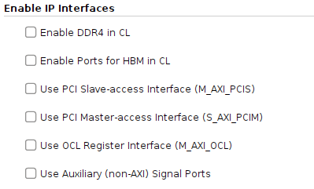
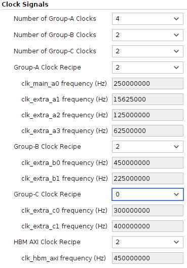
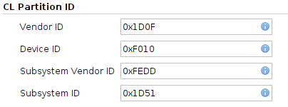

AWS FPGA IP for IP Integrator Overview
======================================

Table of Contents
-----------------

- `AWS FPGA IP for IP Integrator
  Overview <#aws-fpga-ip-for-ip-integrator-overview>`__

  - `Table of Contents <#table-of-contents>`__
  - `AWS IP Overview <#aws-ip-overview>`__
  - `Enable IP Interfaces <#enable-ip-interfaces>`__
  - `Clock Signals <#clock-signals>`__
  - `CL Partition ID <#cl-partition-id>`__
  - `Advanced <#advanced>`__

AWS IP Overview
---------------

The AWS IP serves as a central component in the IP Integrator (IPI)
designs, providing essential AXI interfaces (OCL, PCIS and PCIM) for
Host-FPGA communication, configurable clock management through
predefined recipes, and auxiliary signal ports like VLED/VDIP. It
enables seamless integration between CL designs and the F2 Shell.

To configure the AWS IP, double-click the AWS IP block in the ‘Block
Diagram’. The ‘Re-customize IP’ GUI displays four configuration
categories.

Enable IP Interfaces
--------------------

Select the box to enable desired interfaces. The block diagram updates
automatically to show enabled interfaces, ports, and clocks

For details about the shell interface, see `AWS Shell Interface
Specification <./AWS-Shell-Interface-Specification.html>`__.

   Diagram

Clock Signals
-------------

Review the `Clock Recipes User Guide <./Clock-Recipes-User-Guide.html>`__
to determine the number of clocks needed for Groups A, B, and C, and
select appropriate clock recipes for all CL clocks.

   Diagram

**NOTE**: ``clk_main_a0_out`` is a required clock and cannot be
disabled.

**NOTE**: You must select ‘Enable Ports for HBM in CL’ in the ‘Enable IP
Interfaces’ tab to see HBM AXI clock recipe options.

CL Partition ID
---------------

The PCIe Vendor ID, Device ID, Subsystem Vendor ID and Subsystem ID can
be configured. For now these default values typically match AWS examples
and shouldn’t be modified at this time.

   Diagram

Advanced
--------

Pipeline stages configuration:

- Range: 1-4 pipeline stages
- Applies to the ``sh_cl_ddr_stat_`` interface for DDR in the CL
- Selection depends on design size and complexity

`Back to Home <../../index.html>`__
