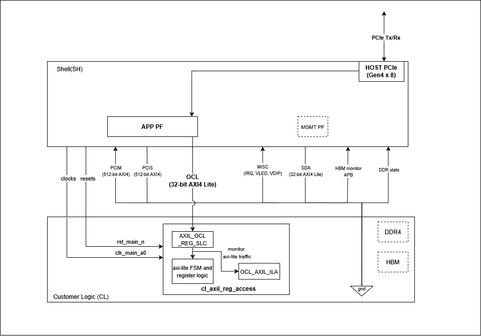

# CL_AXIL_REG_ACCESS

## Table of Contents

1. [Overview](#overview)
2. [Block Diagram](#block-diagram)
3. [Functional Description](#functional-description)
4. [Functional Code Blocks](#functional-code-blocks)
5. [RTL Simulation](#rtl-simulation)
6. [Software Runtime](#software-runtime)

## Overview

The goal of cl_axil_reg_access is to demonstrate:
1. Writing two 32-bit registers on the FPGA, performing an addition operation, and reading the result back to the host using the OCL interface
2. Attaching Integrated Logic Analyzer (ILA) and Virtual JTAG to monitor AXI-Lite traffic

## Block Diagram



## Functional Description

### OCL AXI-Lite Interface

OCL is a 32-bit wide [AXI-Lite interface](https://github.com/aws/aws-fpga/blob/f2/hdk/docs/AWS_Shell_Interface_Specification.md) that provides a communication channel between the host and FPGA. It has a 32MiB register space available (from `0x00000000` to `0x01FFFFFF`) in the custom logic (CL) for register access, control, and monitoring operations. This address space is associated with PCIe Application PF0 and BAR0. Read more about [PCIe BARs here](https://github.com/aws/aws-fpga/blob/f2/hdk/docs/AWS_Fpga_Pcie_Memory_Map.md).

The register map for this example is defined as follows:

| OCL Address | Register name | Access | Register Description |
|-------------|---------------|--------|-----------------------|
| 0x0000_0000 | Operand_A | RW | Bit [31:0]: Holds an unsigned 32-bit integer |
| 0x0000_0004 | Operand_B | RW | Bit [31:0]: Holds an unsigned 32-bit integer |
| 0x0000_0008 | Sum | RO | Bit [31:0]: Holds an unsigned 32-bit integer |
| 0x0000_000C | Carry | RO | Bits [31:1]: Reserved, assigned to 0<br>Bit [0]: Carry output from addition |
| 0x0000_0010 | Control_Status | RW | Bits [31:2]: Reserved, assigned to 0<br>Bit [1]: Ready bit (RO, indicates result is ready)<br>Bit [0]: Start bit (write 1 to trigger operation) |

**Note:**
- **RW (Read-Write)**: Register can be both read from and written to by the host
- **RO (Read-Only)**: Register can only be read by the host
- Any access to addresses outside this range will return `0xDEADBEEF`

### Configuration Sequence

For software runtime, follow this configuration sequence:

1. **Write operands** — write input values to `Operand_A` and `Operand_B` registers
2. **Trigger addition** — write `1` to bit [0] of `Control_Status` register; this starts the addition and computes `{Carry[0], Sum} = Operand_A + Operand_B`
3. **Poll for completion** — read bit [1] of `Control_Status` register and wait until it is set to `1`; this indicates the result is ready
4. **Read results** — read `Sum` and `Carry` registers; bit[1] of `Control_Status` register is automatically cleared after these registers have been read

## Functional Code Blocks

### Register Access

**Register Write:**

Write operations update registers in the `WRITE` state, when both address and data handshakes are complete:

```systemverilog
// Register writes
always_ff @(posedge clk_main_a0) begin
  if (next_state == WRITE) begin
    case (write_addr)
      ADDR_OPERAND_A : reg_operand_a <= sh_ocl_wdata_q;
      ADDR_OPERAND_B : reg_operand_b <= sh_ocl_wdata_q;
    endcase
  end
end
```

**Register Read:**

Read operations return register values when the read address handshake completes. Invalid addresses return `0xDEADBEEF`:

```systemverilog
// Register reads
always_ff @(posedge clk_main_a0) begin
  if (addr_rd_handshake) begin
    case (sh_ocl_araddr_q)
      ADDR_OPERAND_A       : ocl_sh_rdata_q <= reg_operand_a;
      ADDR_OPERAND_B       : ocl_sh_rdata_q <= reg_operand_b;
      ADDR_SUM             : ocl_sh_rdata_q <= reg_sum;
      ADDR_CARRY           : ocl_sh_rdata_q <= reg_carry;
      ADDR_CONTROL_STATUS  : ocl_sh_rdata_q <= reg_control_status;
      default              : ocl_sh_rdata_q <= INVALID_ADDR_RESP;
    endcase
  end
end
```

### AXI-Lite FSM

The AXI-Lite interface is controlled by a 5-state FSM:

| State | Description |
|-------|-------------|
| `IDLE` | Ready to accept a new transaction. `awready` and `wready` asserted for write; `arready` asserted for read |
| `WRITE_WAIT` | One write channel (address or data) arrived first — waits for the other |
| `WRITE` | Both address and data are valid; register write executes this cycle |
| `WRITE_RESP` | Sends write response (`bvalid`); waits for `bready` from the host |
| `READ` | Read data presented on `rdata` (`rvalid` asserted)|

```systemverilog
always_comb begin
  next_state = current_state;
  case (current_state)

    IDLE: begin
      if (addr_wr_handshake && data_wr_handshake)
        next_state = WRITE;
      else if (addr_wr_handshake || data_wr_handshake)
        next_state = WRITE_WAIT;
      else if (addr_rd_handshake)
        next_state = READ;
    end

    WRITE_WAIT: begin
      if (addr_wr_handshake || data_wr_handshake)
        next_state = WRITE;
    end

    WRITE: begin
      next_state = WRITE_RESP;
    end

    WRITE_RESP: begin
      if (bresp_handshake)
        next_state = IDLE;
    end

    READ: begin
      if (data_rd_handshake)
        next_state = IDLE;
    end

    default: begin
      next_state = IDLE;
    end
  endcase
end
```

### Virtual JTAG

One ILA core is attached to the OCL AXI-Lite bus. Virtual JTAG access is enabled via MgmtPF BAR2 using the debug bridge. Refer to the [Virtual JTAG Debug Guide](../../../../docs/Virtual_JTAG_XVC.md) to connect Vivado Hardware Manager to the XVC server for real-time register monitoring and debugging.

### Clock and Reset

This example uses `clk_main_a0` clock at 250MHz and `rst_main_n` reset provided by the AWS Shell to the CL.

### Resource Utilization

| Resource         | Used  | Utilization |
|------------------|------:|------------:|
| CLB LUTs         | 3,412 | 0.26%       |
| CLB Registers    |   335 | <0.01%      |
| CLB              | 1,634 | 1.00%       |
| URAM             |     0 | 0.00%       |
| DSPs             |     0 | 0.00%       |
| CARRY8           |     5 | <0.01%      |

## RTL Simulation

For detailed descriptions of all simulation tests and how to run them, refer to [verif/README.md](verif/README.md).

## Software Runtime

The runtime examples are located in the `software/runtime` directory. To compile and run a test:

```bash
cd $CL_DIR/software/runtime
make all
sudo ./test_sum
```

This example includes software tests demonstrating register-based communication via the OCL interface. All tests use utility functions from `cl_axil_reg_access_utils.c`.

### FPGA API Functions

`fpga_pci_attach()` establishes a connection to a specific PCIe BAR on the FPGA. It takes the slot ID, physical function (PF) ID, BAR ID, flags, and returns a handle for accessing that BAR's memory space. This is done before performing any register access:

```c
// Attach to OCL BAR
rc = fpga_pci_attach(slot_id, pf_id, bar_id, flags, &pci_bar_handle);
```

Writing to OCL registers:

```c
// Write operand A at address 0x0000
fpga_pci_poke(pci_bar_handle, 0x0000, operand_a);

// Write operand B at address 0x0004
fpga_pci_poke(pci_bar_handle, 0x0004, operand_b);
```

Reading from OCL registers:

```c
// Read sum result at address 0x0008
fpga_pci_peek(pci_bar_handle, 0x0008, &result);
```

> 📓 For an interactive, step-by-step walkthrough of the software runtime example, refer to the [cl_axil_reg_access Jupyter notebook](../../../../../sdk/notebooks/README.md).
